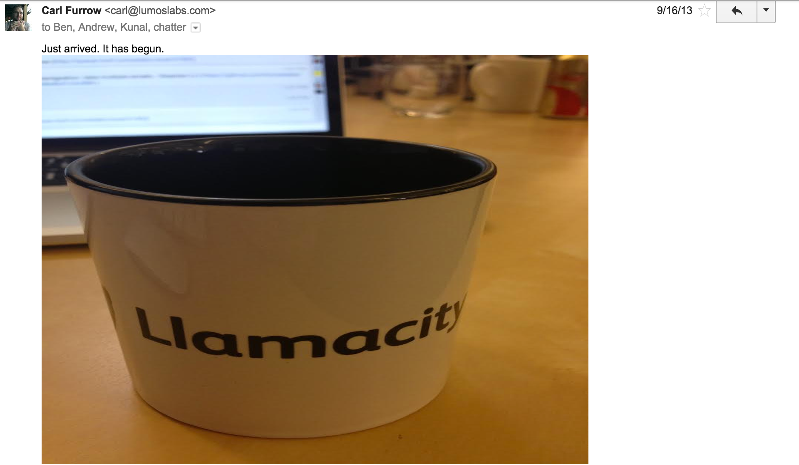

# Llamacity/Llamasity?
It all started in September of 2013. Andy Xue's parents were visiting the office, took a picture, and left. I don't know if anyone really saw them while they were here, but we all found out about it when Andy forwarded their email to chatter:

We've all see mispellings or mispronunciations of "Lumosity", but this one struck me funny. I immediately fired up Photoshop, and punched this out:

 

 

From there, I created many-a-llama-themed-photoshops and a few more products.

## Can I get one of those mugs?
Yes, they are still for purchase exclusively for Lumosity employees only. Please don't share [this link](https://www.zazzle.com/llamacity_logo_black_two_tone_coffee_mug-168747457769161104) with any "normies".

<h2 class='center'><a href="https://www.zazzle.com/llamacity_logo_black_two_tone_coffee_mug-168747457769161104">Buy now!</a></h2>

*Note: I set the price as low as I could to not make any profit from it, but I think I still get $0.05 per order*

## So, you still do that whole "llama" thing?
Yes! I've grown to admire llamas over the years, and even got to meet some awesome llamas over in Oakland back in 2015 thanks to an awesome Lumosity team outing!

 
<cite>From left to right: forgot his name, Fred, Mick Jagger</cite>

And that's really it! Just love llamas, that's all.

